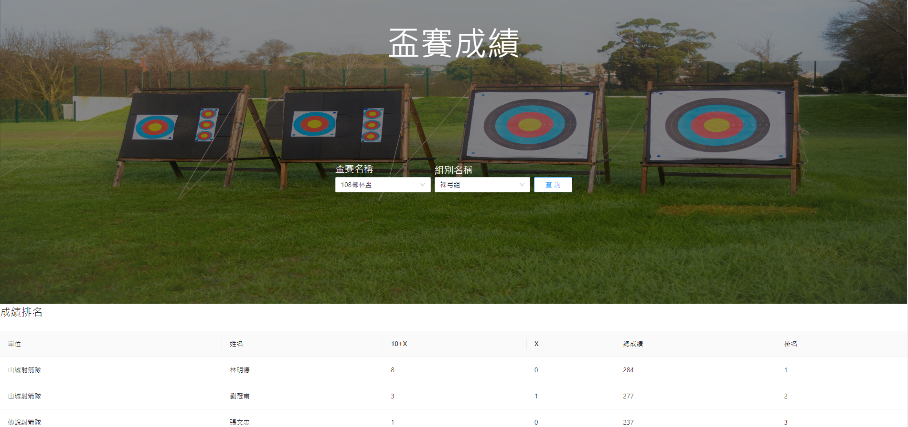
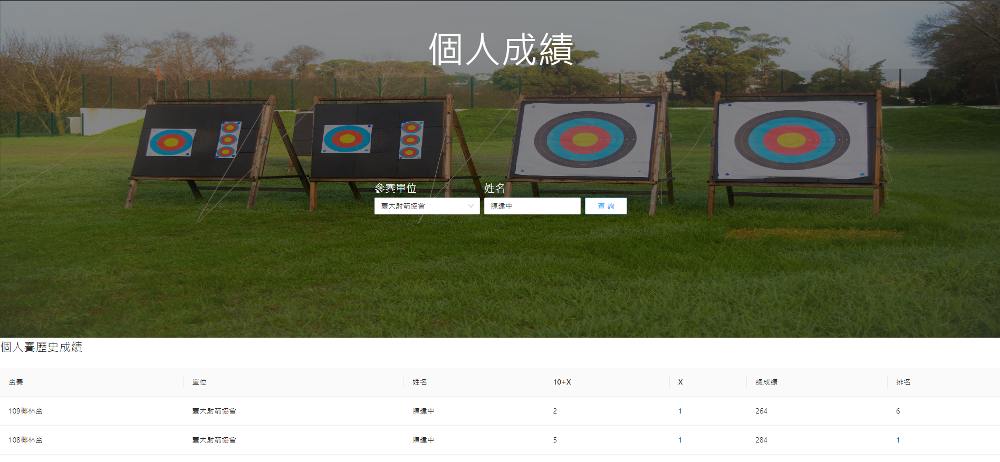

# 射箭計分系統
查詢個人和團體成績，並且登入比賽分數。

### Contributors & Tasks
- 陳煒勳 Database schema design, data colleciton and process using postgreSQL 
- 高何銓 Back-end using Django
- 朱修平 Front-end using ReactJS
- 董安宜 Make ppt, video and document.
## Database 

- 下載 [PostgreSQL 13](https://www.postgresql.org/download/) 以及 [pdAdmin](https://www.pgadmin.org/) (GUI介面)
- data_preprocess 做資料的前處理以及匯入資料
- Archery_customs.sql 裝有資料

### API
- **討論文件**：https://hackmd.io/3-19qjIzRNOtWahTSrR1Wg?view#Postapiscoreboardindividual
- **API endpoint**: http://127.0.0.1:8000/api
- **九個接口**
    > Get/api/units
    
    > Get/api/cups
    
    > Get/api/groups
    
    > Post/api/scoreboard/target
    
    > Post/api/scoreboard/individual
    
    > Post/api/liveScore
    
    > Post/api/search/individual
    
    > Post/api/search/team
    
    > Post/api/search/cup
    

## Backend

確定電腦有安裝 `python3` 以及完成上述資料匯入資料庫的指令後打開終端機執行以下指令：

```shell
# for mac
cd backend
python3 -m venv my-env #建立虛擬環境 #-m: module-name
source my-env/bin/activate #啟動虛擬環境 for mac
```

```shell
# for windows
cd backend
python -m venv my-env #建立虛擬環境 #-m: module-name
my-env\Scripts\activate.bat #啟動虛擬環境 for windows
```

成功的話，command prompt 前面應該會多出 `(my-env)` 的字樣，代表已經進入這個虛擬環境。如果未來你想退出這個虛擬環境，可以輸入 `deactivate`。
接著下載所需套件，需要的套件與版本已定義在 `requirements.txt`，下載完輸入`pip list`檢查所有用 `pip` 下載的套件。

```shell
python -m pip install --upgrade pip #pip更新至最新版本
pip install -r requirements.txt
pip list
```
```
Package             Version
------------------- -------
asgiref             3.4.1
dj-database-url     0.5.0
Django              3.2.6
django-cors-headers 3.8.0
djangorestframework 3.12.4
pip                 21.3
psycopg2            2.9.1
python-decouple     3.4
pytz                2021.1
setuptools          47.1.0
sqlparse            0.4.1
```

安裝完套件後複製 `.env.example` 的內容到 `.env`。

>`.env`裡存的是環境變數，請將 `.env` 當中的變數(DATABASE_URL)改成符合你電腦資料庫的值。


最後，同步資料庫並啟動 backend server。

```shell
python manage.py migrate
python manage.py runserver
```

用瀏覽器打開  http://127.0.0.1:8000/api/cups ，如果有順利拿到資源表示後端起成功。

## Frontend

#### Step 1. 安裝 packages
```shell
cd frontend
yarn
```

#### Step 2. 開啟前端
```shell
cd frontend
yarn start
```
#### Step 3. 開啟瀏覽器 
一般情況會自動開啟瀏覽器，若沒有請手動開啟 http://127.0.0.1:3000/ ，看到以下畫面即代表成功開啟前端且前後端連接成功。

#### 主頁

#### 盃賽成績查詢

#### 個人成績查詢

#### 分數登錄


